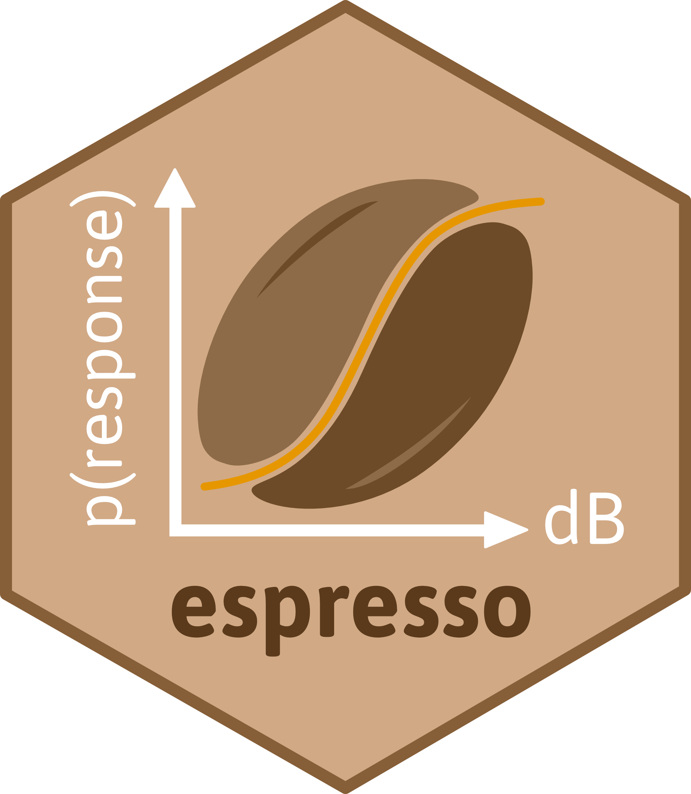

<!-- README.md is generated from README.Rmd. Please edit that file -->

```{r, include = FALSE}
knitr::opts_chunk$set(
  collapse = TRUE,
  comment = "#>",
  fig.path = "man/figures/README-",
  out.width = "100%"
)
```

# Multi-species Bayesian dose-response models 

<!-- badges: start -->
[](https://www.tidyverse.org/lifecycle/#maturing)
[](https://www.repostatus.org/#active)
<!-- badges: end -->

`espresso` stands for **E**stimating **S**hared **P**atterns of **RES**ponsiveness to Navy **SO**nar, and was designed as a toolkit for fitting and selecting among behavioural dose-response functions in cetaceans exposed to anthropogenic sound.

## Rationale

This work builds upon previous research completed under the U.S. Navy-funded [MOCHA project](https://synergy.st-andrews.ac.uk/mocha/) [@Harris2016; @Harris2018], in which Bayesian hierarchical models were developed to estimate the probabilities of noise-related behavioural impacts to individual marine mammals, whilst accounting for uncertainty and the effects of contextual covariates [@Miller2014; @Antunes2014]. The current modelling framework is implemented in the Bayesian analysis software JAGS (<https://mcmc-jags.sourceforge.io/>), and relies on Gibbs Variable Selection [@OHara2009] to identify groups of species exhibiting similar patterns of responsiveness to impulsive sound stimuli. However, this approach proves computationally intractable for more than a few species and/or covariates. `espresso` uses a bespoke dimension-jumping reversible-jump Markov chain Monte Carlo algorithm [rjMCMC, @Green1995; @Hastie2012] to relax these constraints and allow species groupings to be identified in an objective, data-driven way. The package also accommodates: (1) the selection of any number of explanatory covariates (e.g., sonar frequency, previous history of exposure, feeding behaviour, source-whale range), (2) the comparison of dose-response functional forms (i.e., monophasic or biphasic [soon to be released]), and (3) the appropriate treatment of both left- and right-censored observations (i.e., animals which display either an immediate response on first exposure, or no signs of response across the array of doses received, respectively).

## Getting started

If you are just getting started with `espresso`, we recommend reading the [tutorial vignette](https://pjbouchet.github.io/espresso/articles/espresso.html), which provides a quick introduction to the package.

## Installation

Install the GitHub development version to access the latest features and patches.

```{r, eval = FALSE}
# install.packages("remotes")
remotes::install_github("pjbouchet/espresso") # OR

# install.packages("devtools")
devtools::install_github("pjbouchet/espresso")
```

The package relies on compiled code (C++) and functionalities provided by the [Rcpp](https://cran.r-project.org/web/packages/Rcpp/index.html) package. The Rtools software may be needed on Windows machines. 
Installation instructions can be found at <https://cran.r-project.org/bin/windows/Rtools/rtools40.html>.

## References
