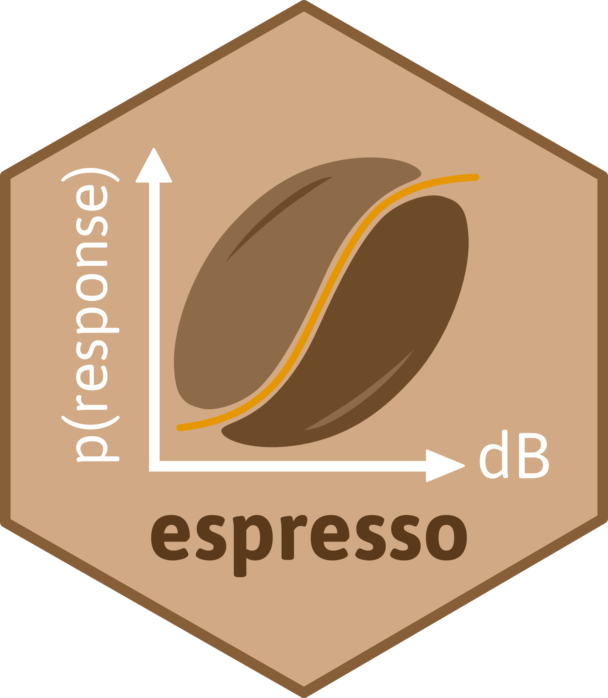

<!-- README.md is generated from README.Rmd. Please edit that file -->

# Multi-species Bayesian dose-response models 

<!-- badges: start -->

[](https://www.tidyverse.org/lifecycle/#maturing)
[](https://www.repostatus.org/#active)
<!-- badges: end -->

`espresso` stands for **ES**timating **P**atterns of **RES**ponsiveness
to Navy **SO**nar, and was designed as a toolkit for fitting and
selecting among behavioural dose-response functions in cetaceans exposed
to anthropogenic sound.

## Rationale

This work builds upon previous research completed under the U.S.
Navy-funded [MOCHA project](https://synergy.st-andrews.ac.uk/mocha/)
(Harris et al. 2016, 2018), in which Bayesian hierarchical models were
developed to estimate the probabilities of noise-related behavioural
impacts to individual marine mammals, whilst accounting for uncertainty
and the effects of contextual covariates (Miller et al. 2014; Antunes et
al. 2014). The current modelling framework is implemented in the
Bayesian analysis software JAGS (<https://mcmc-jags.sourceforge.io/>),
and relies on Gibbs Variable Selection (O’Hara and Sillanpää 2009) to
identify groups of species exhibiting similar patterns of responsiveness
to impulsive sound stimuli. However, this approach proves
computationally intractable for more than a few species and/or
covariates. `espresso` uses a bespoke dimension-jumping reversible-jump
Markov chain Monte Carlo algorithm (rjMCMC, Green 1995; Hastie and Green
2012) to relax these constraints and allow species groupings to be
identified in an objective, data-driven way. The package also
accommodates: (1) the selection of any number of explanatory covariates
(e.g., sonar frequency, previous history of exposure, feeding behaviour,
source-whale range), (2) the comparison of dose-response functional
forms (i.e., monophasic or biphasic \[soon to be released\]), and (3)
the appropriate treatment of both left- and right-censored observations
(i.e., animals which display either an immediate response on first
exposure, or no signs of response across the array of doses received,
respectively).

## Getting started

If you are just getting started with `espresso`, we recommend reading
the [tutorial
vignette](https://pjbouchet.github.io/espresso/articles/espresso.html),
which provides a quick introduction to the package.

## Installation

Install the GitHub development version to access the latest features and
patches.

``` r
# install.packages("remotes")
remotes::install_github("pjbouchet/espresso") # OR

# install.packages("devtools")
devtools::install_github("pjbouchet/espresso")
```

The package relies on compiled code (C++) and functionalities provided
by the [Rcpp](https://cran.r-project.org/web/packages/Rcpp/index.html)
package. The Rtools software may be needed on Windows machines.
Installation instructions can be found at
<https://cran.r-project.org/bin/windows/Rtools/rtools40.html>.

## References

<div id="refs" class="references csl-bib-body hanging-indent">

<div id="ref-Antunes2014" class="csl-entry">

Antunes, R., P. H. Kvadsheim, F. P. A. Lam, P. L. Tyack, L. Thomas, P.
J. Wensveen, and P. J. O. Miller. 2014. “<span class="nocase">High
thresholds for avoidance of sonar by free-ranging long-finned pilot
whales (Globicephala melas)</span>.” *Mar. Pollut. Bull.* 83 (1):
165–80. <https://doi.org/10.1016/j.marpolbul.2014.03.056>.

</div>

<div id="ref-Green1995" class="csl-entry">

Green, Peter J. 1995. “<span class="nocase">Reversible jump Markov chain
Monte Carlo computation and Bayesian model determination</span>.”
*Biometrika* 82 (4): 711–32. <https://doi.org/10.1093/biomet/82.4.711>.

</div>

<div id="ref-Harris2018" class="csl-entry">

Harris, Catriona M., Len Thomas, Erin A. Falcone, John Hildebrand,
Dorian Houser, Petter H. Kvadsheim, Frans-Peter A. Lam, et al. 2018.
“<span class="nocase">Marine mammals and sonar: Dose-response studies,
the risk-disturbance hypothesis and the role of exposure
context</span>.” *J. Appl. Ecol.* 55 (1): 396–404.
<https://doi.org/10.1111/1365-2664.12955>.

</div>

<div id="ref-Harris2016" class="csl-entry">

Harris, Catriona M., Len Thomas, Dina Sadykova, Stacy L. DeRuiter, Peter
L. Tyack, Brandon L. Southall, Andrew J. Read, and Patrick J. O. Miller.
2016. “<span class="nocase">The Challenges of Analyzing Behavioral
Response Study Data: An Overview of the MOCHA (Multi-study OCean
Acoustics Human Effects Analysis) Project</span>.” *Adv. Exp. Med.
Biol.* 875: 399–407. <https://doi.org/10.1007/978-1-4939-2981-8_47>.

</div>

<div id="ref-Hastie2012" class="csl-entry">

Hastie, David I., and Peter J. Green. 2012. “<span class="nocase">Model
choice using reversible jump Markov chain Monte Carlo</span>.” *Stat.
Neerl.* 66 (3): 309–38.
<https://doi.org/10.1111/j.1467-9574.2012.00516.x>.

</div>

<div id="ref-Miller2014" class="csl-entry">

Miller, Patrick J. O., Ricardo N. Antunes, Paul J. Wensveen, Filipa I.
P. Samarra, Ana Catarina Alves, Peter L. Tyack, Petter H. Kvadsheim, et
al. 2014. “<span class="nocase">Dose-response relationships for the
onset of avoidance of sonar by free-ranging killer whales</span>.” *J.
Acoust. Soc. Am.* 135 (2): 975. <https://doi.org/10.1121/1.4861346>.

</div>

<div id="ref-OHara2009" class="csl-entry">

O’Hara, Robert B, and Mikko J Sillanpää. 2009. “A Review of Bayesian
Variable Selection Methods: What, How and Which.” *Bayesian Analysis* 4
(1): 85–117.

</div>

</div>
